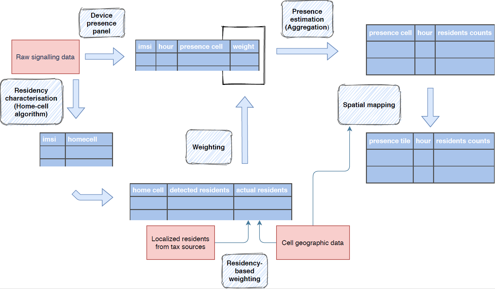
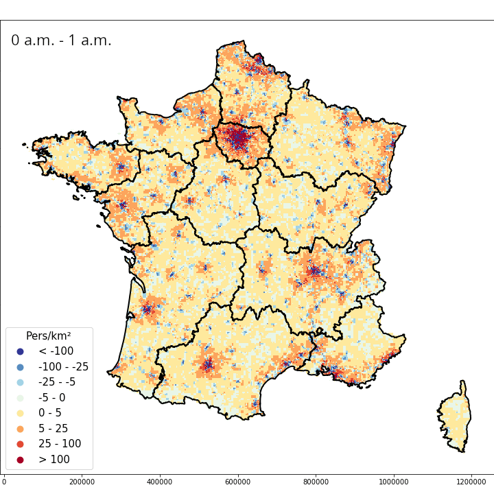
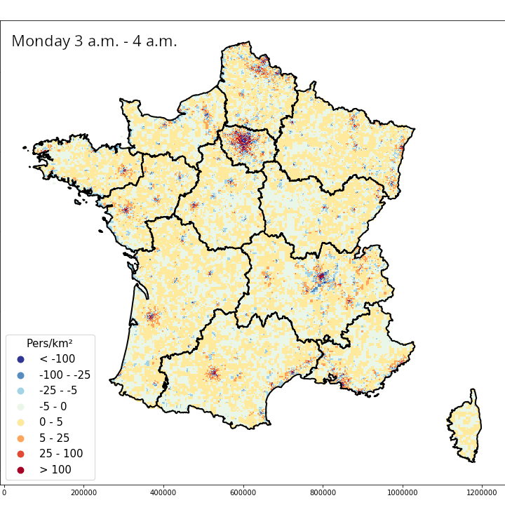
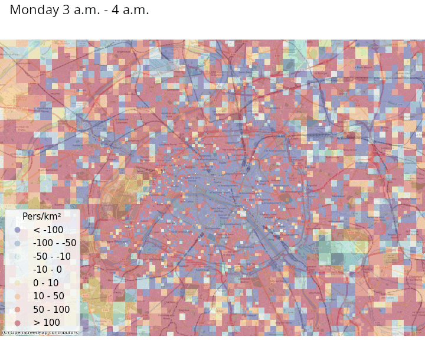

# Replication codes for "Temporally Consistent Present Population from Mobile Phone Signaling Data for Official Statistics"
--------
by Milena Suarez Castillo, François Sémécurbe, Cezary Ziemlicki, Haixuan Xavier Tao and Tom Seimandi.

The pipeline is organized in several modules as follows:



Figure: _Overview of the method implementation._ Red boxes represent source datasets, dark
blue boxes represent produced datasets and the key variables. Arrows represent transforms, which pertain
to a given module referenced in light blue boxes.


* Pseudo-code (folder `pseudo-code`) implements the modules "Device presence panel", "Residency characterisation (home celle algorithm)", "weighting", "presence estimation (aggregation)". This code was run on the premises of the MNO.

* A `Python` package (folder `mobitic_utils`) implements the modules "residency-based weighting" (`weighting.py`), "spatial mapping" (`spatial_mapping.py`), and the different outputs and figures of the paper. Output statistics are uploaded into a PostGIS database, and this code implements utils to do so. Parameters and credentials for the database must be stored as environment variables, using the following command in a Terminal:
```
export POSTGRESQL_HOST="xxx"
export POSTGRESQL_USER="xxx"
export POSTGRESQL_PASSWORD="xxx"
export POSTGRESQL_PORT=xxxx
```
    
or in a Jupyter notebook:

```
%env POSTGRESQL_HOST="xxx"
%env POSTGRESQL_USER="xxx"
%env POSTGRESQL_PASSWORD="xxx"
%env POSTGRESQL_PORT=xxxx
```

We are storing the outputs from the pseudo-code run on the MNO premises on `s3`, which are used as inputs of the the functions from the `mobitic_utils` package. The endpoint url, bucket and different file paths we use are defined in `mobitic_utils/constants.py`. Finally since this data is encrypted, we must use an encryption key which we store using `Vault`: the path and key used to retrieve this encryption key are also defined in `constants.py` (`VAULT_PATH` and `VAULT_KEY`).

* Figures and Tables from the paper have been obtained with the notebooks in the `notebook` folder, which call functions from the python package.


Installation
--------

To install the `mobitic_utils` package you just need to git clone and install with pip:

```
git clone https://github.com/InseeFrLab/presentpop.git
cd presentpop
pip3 install . --user
```


Populate Postgre DB with Dynamic Population Data
--------

To populate the PostgreSQL database:

```
python3 mobitic_utils/__main__.py init-db
```

Comparison metrics (Table 4 of the Journal of Official Statistics paper)
--------

The code to obtain the comparison metrics is `mobitic_utils/metrics.py`. Functions from this file were used in `notebook/table_population_density_comparison.ipynb`

Maps and Figures
--------

The maps and figures are obtained in the notebooks: `notebook/*`.

The four animated figures displayed below are in the `gifs` folder and are the output of `notebook/gif_maps.ipynb`. They give the variation of present population density (persons per square kilometer), hourly within day and daily within week, at the national level and in Paris.

<u>France, hourly and daily variations :</u>

<p float="left">
  
  
</p>

<u>Paris, hourly and daily variations :</u>

<p float="left">
  
  
</p>
